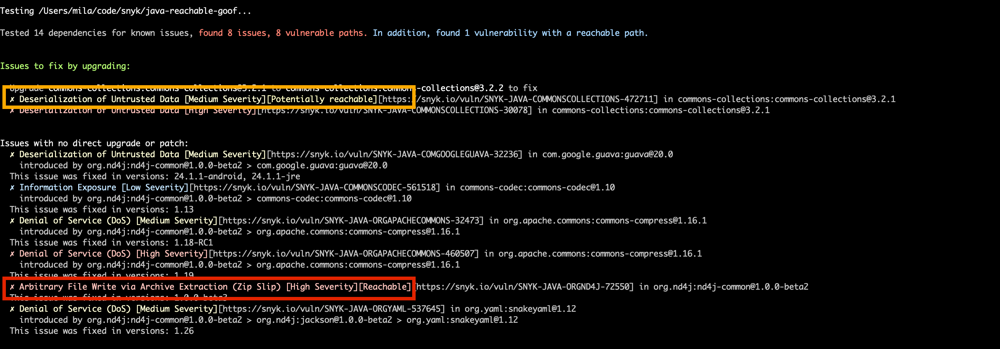
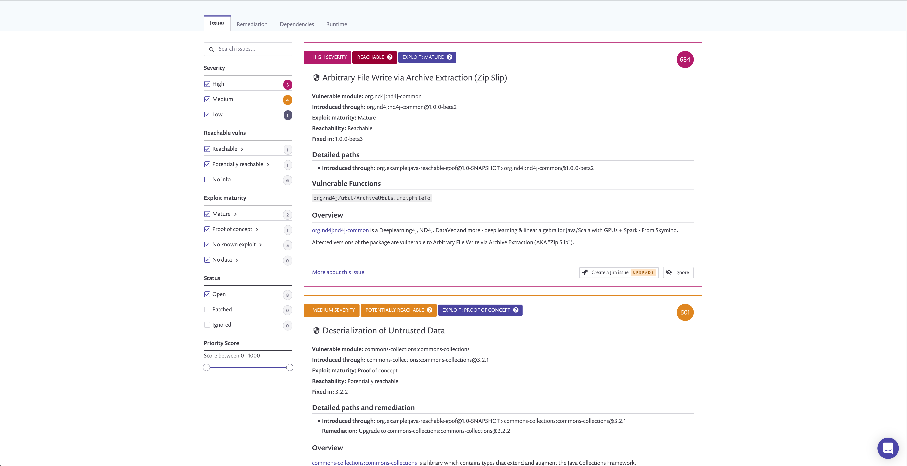

# Java Reachability Playground

This is an intentionally vulnerable application. It was purposely designed to demonstrate the capabilities of Snyk's Reachable
Vulnerabilities feature and includes both a "Reachable" vulnerability (with a direct data flow to the vulnerable function) and a "Potentially Reachable" vulnerability (where only partial data exists for determining reachability).

## Included vulnerabilities
### [Arbitrary File Write via Archive Extraction](https://app.snyk.io/vuln/SNYK-JAVA-ORGND4J-72550)
An exploit is using a vulnerability called [ZipSlip](https://snyk.io/research/zip-slip-vulnerability) - a critical vulnerability discovered 
by Snyk, which typically results in remote command execution. As part of the exploit, a special zip archive is 
crafted (attached as `malicious_file.zip`). When this file is extracted by a vulnerable function, it will create a file 
called `good.txt` in the folder `unzipped`, but it will also create a file called `evil.txt` in the `/tmp/` folder. 
This example is not dangerous, of course, but demonstrates the risk the vulnerability poses - imagine overwriting `.ssh/authorized_keys` or another sensitive file.

### [Deserialization of Untrusted Data](https://app.snyk.io/vuln/SNYK-JAVA-COMMONSCOLLECTIONS-472711)
This vulnerability is not exploited. It demonstrates potentially vulnerable code, for which data about vulnerable functions
is not available.

## How to run the demo (Maven)
1. Checkout this repository (`git checkout git@github.com:snyk/java-reachability-playground.git`)
2. Install all the dependencies (`mvn install`)
3. Compile the project (`mvn compile`)
4. Run the main class (`mvn exec:java -Dexec.mainClass=Unzipper`); the application should throw an exception saying `Malicious file /tmp/evil.txt was created`.
5. Run snyk command with Reachable Vulnerabilities flag (`snyk test --reachable` or `snyk monitor --reachable`); you should see the vulnerability `SNYK-JAVA-ORGND4J-72550` marked as reachable
and the function call path to the vulnerability

## For Gradle 
1. Make sure you build the artifacts with `./gradlew build`
2. To see test results run `snyk test --file=build.gradle --reachable` or monitor: `snyk monitor --file=build.gradle --reachable`
---

*Note: Once the java application is run, `malicious_file.zip` will be deleted by it. To run it again, run `git checkout .` prior
to next java run.*

## Screenshots

### CLI

### Snyk UI

